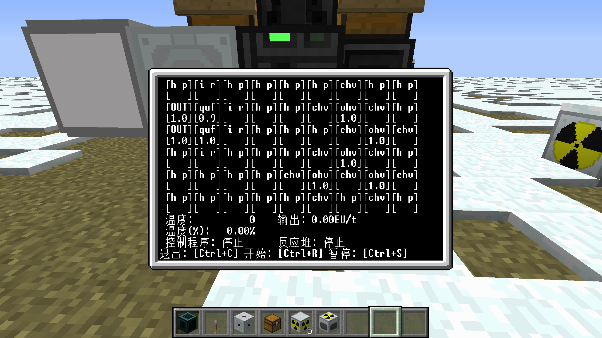

# 关于本仓库
本仓库包含了我自己编写的可以在开放式电脑(Open Computers)模组中运行的lua程序。***如果你在运行程序时遇到问题，请尽量在GitCode上提交issue，GitHub上的issue我可能无法。***

GitCode仓库地址: https://gitcode.com/Yutyrannus_huali/OpenComputer-Apps

GitHub仓库地址: https://github.com/Yutyrannushuali/OpenComputer_Apps

# 关于开放式电脑(Open Computers)
OpenComputers 是一款 Minecraft 模组，为游戏添加了可编程计算机和机器人。

一些相关链接:  
[英文Wiki](https://ocdoc.cil.li/start)  
[中文Wiki](https://ocdoc.cil.li/start:zh)  
[MC百科](https://www.mcmod.cn/class/389.html)

# 程序介绍
## [**ic2_reactor_ctrl.lua**](src/ic2_reactor_ctrl/ic2_reactor_ctrl.lua)

*这是一个用于控制 IC2(Industrial Craft 2) 反应堆的程序，可以显示反应堆的当前状态及其内部组件的摆放方式、剩余耐久。同时，这个程序也能控制反应堆的启动和暂停，在反应堆内组件耐久过低时进行更换。*

### 下载方法
**1. 输入以下指令以下载本程序**
```
wget -f https://raw.gitcode.com/Yutyrannus_huali/OpenComputer-Apps/raw/main/src/ic2_reactor_ctrl/ic2_reactor_ctrl.lua ic2_reactor_ctrl.lua
```
**2.下载源码复制到存档**

[如何将本地文件复制到游戏中的计算机内](docs/tutorial/如何将本地文件复制到游戏中的计算机内.md)