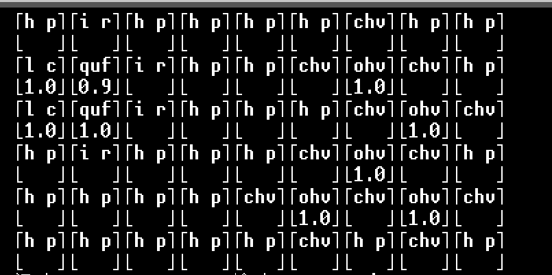
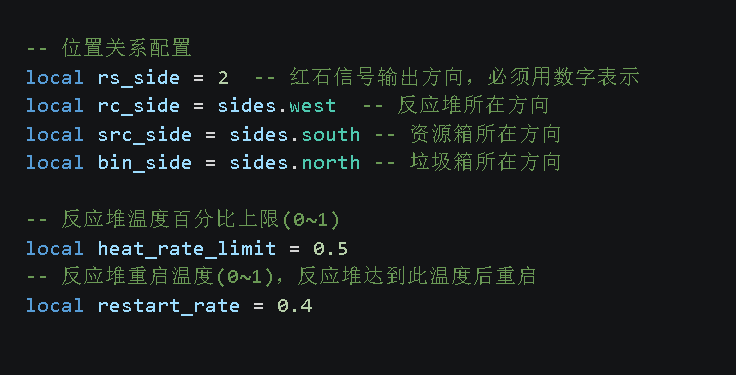

# ic2_reactor_ctrl.lua
## 目录
- [UI介绍](##UI介绍)
- [功能介绍](##功能介绍)
- [配置必要参数](##配置必要参数)
## UI介绍

***
该程序UI可分为三部分：
1. 反应堆内部组件信息

这一部分展示了反应堆内部各个槽位放置的组件名称(上半部分，枯竭铀和枯竭MOX显示为OUT)和该组件的耐久值(下半部分，1.0表示满耐久，不会损坏的组件不会显示耐久值)。
2. 反应堆及反应堆控制程序状态信息

* “温度”为反应堆对温，数值为整数
* “温度(%)”为反应堆对温的百分比（反应堆GUI中显示的堆温），数值为2位小数
* “输出”为反应堆输出的能量（反应堆GUI中显示的输出），数值保留2位小数
* “控制程序”是展示反应堆控制程序是否在运行
* “反应堆”是展示反应堆是否在工作
* 当温度过高，反应堆控制程序控制反应堆停机时，“输出”和“反应堆”中间会显示“Cooling”表示反应堆正在冷却
3. 快捷键

指令的执行有延迟，所以按下快捷键后，需要等待一段时间才能看到效果。

## 功能介绍
该程序具有如下功能：
1. 显示反应堆内部组件信息
2. 显示反应堆及反应堆控制程序状态信息
3. 自动更换燃料和即将损坏的组件
4. 在反应堆温度达到设定的上限时停止反应堆，并在温度下降到特定值时重新启动反应堆
5. 在资源箱中缺少必要组件时停止反应堆并终止程序运行

## 配置必要参数
编辑文件ic2_reactor_ctrl_config.lua，配置如图所示参数：

